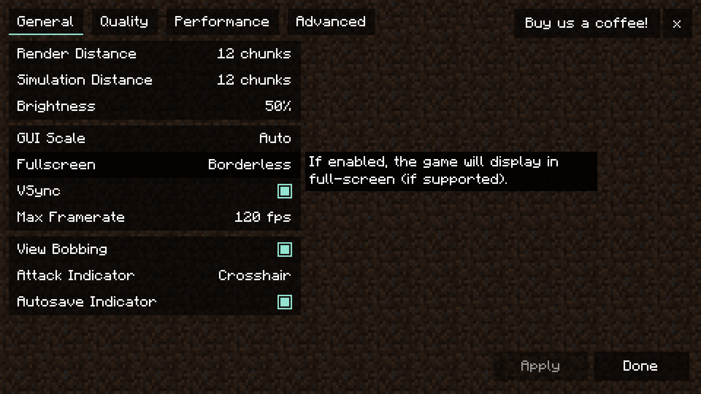

# Cubes Without Borders

[](https://github.com/Kir-Antipov/cubes-without-borders/actions/workflows/build.yml)
[](https://github.com/Kir-Antipov/cubes-without-borders/releases/latest)
[](https://modrinth.com/mod/cubes-without-borders)
[](https://www.curseforge.com/minecraft/mc-mods/cubes-without-borders)
[](LICENSE.md)


A mod that allows you to play Minecraft in a borderless fullscreen window. This means you can keep the game open while interacting with other applications on a different monitor, or even directly on top of Minecraft itself, without the game minimizing.

What sets **Cubes Without Borders** apart from other "borderless fullscreen" mods on the market is its explicit support for all major platforms: Linux, macOS, and even Windows. Instead of focusing on just one platform and leaving the mod broken for users of other operating systems, this project strives to provide the best possible experience for everyone, right out of the box. No screen flickering, no strange compositing glitches, no need to sacrifice the ability to change your game's resolution - just smooth, borderless fullscreen gameplay, as it was meant to be.

----

## Usage

To enable borderless fullscreen, go to the `Video Settings` tab where you'd typically find the `Fullscreen` setting, and switch it to the newly added third option: `Borderless`.

Depending on whether you have Sodium installed, you may find the option in question here:

|  |  |
| - | - |

Additionally, the mod introduces a `--borderless` startup flag for those interested. This flag works the same way as the existing `--fullscreen` one, but forces the game to start in borderless fullscreen mode instead.

----

## Config

The mod provides a simple configuration screen, which can be accessed if you have [`Cloth Config API`](https://modrinth.com/mod/cloth-config) installed:


| Name | Description |
|:-----|-------------|
| Pause On Lost Focus | If set to `Yes`, Minecraft will automatically pause whenever its window loses focus |
| Fullscreen Type | Allows you to override the default fullscreen type used by Minecraft when the `Fullscreen` setting is set to `ON` |
| Borderless Fullscreen Type | Allows you to override the borderless fullscreen type used when the `Fullscreen` setting is set to `Borderless` |

### Fullscreen Types

| Name | Description |
|------|-------------|
| `minecraft:default` | Default fullscreen mode used by Minecraft |
| `minecraft:windowed` | OS-agnostic windowed fullscreen mode<br><br>This implementation is not tied to a specific OS, making it susceptible to quirks across different platforms. While it generally shouldn't be preferred over other fullscreen types, it might work well in certain contexts. |
| `linux:borderless` | Borderless fullscreen mode for Linux systems<br><br>It works well in most cases; however, due to [the FreeDesktop spec](https://specifications.freedesktop.org/wm-spec/wm-spec-1.3.html#STACKINGORDER), you may notice that conforming desktops *(like **KDE Plasma**)* don't place PiP windows *(e.g., media players)* above fullscreen windows. To fix this, change the layer of the window in question to `OSD` or `Overlay` *([here's an example for Firefox](media/kde-plasma-window-rules.png))*.<br>If you use **KDE Plasma** with an auto-hiding/dodging taskbar, you might want to try `minecraft:windowed`, as it functions pretty nicely in this scenario. |
| `macos:borderless` | Borderless fullscreen mode for macOS systems |
| `windows:borderless` | Borderless fullscreen mode for Windows systems<br><br>This implementation has a few quirks and doesn't always work well with overlays *(like the one from Discord)*. If possible, it is generally recommended to use `windows:windowed` instead. |
| `windows:windowed` | Windowed fullscreen mode for Windows systems<br><br>This provides the best experience for Windows users overall. The only known issue is that **OBS Game Capture** doesn't automatically detect Minecraft's window when using this mode. This is a bug with OBS, and I submitted a [pull request](https://github.com/obsproject/obs-studio/pull/10880) to address it. If it hasn't been merged yet, and this feature is important to you, consider using other fullscreen types as a temporary workaround. |
| `windows:exclusive` | Exclusive fullscreen mode for Windows systems that mimics some qualities of borderless fullscreen<br><br>You might be familiar with this if you're coming from mods like [`CW/B`](https://github.com/Kir-Antipov/cubes-with-borders) or [`Borderless Mining`](https://github.com/comp500/BorderlessMining)<br><br>However, it generally shouldn't be used, as it causes notorious screen flickering whenever the game window loses or regains focus, and it doesn't cooperate well with compositing.<br>Unless you're specifically aiming to minimize input lag in the game about blocks, which is the main and only benefit of this mode, it's best to consider other options. |

---

## Build

Requirements:

 - JDK `17`

```bash
git clone https://github.com/Kir-Antipov/cubes-without-borders
cd cubes-without-borders
./gradlew build
```

----

## License

Licensed under the terms of the [MIT License](LICENSE.md).
